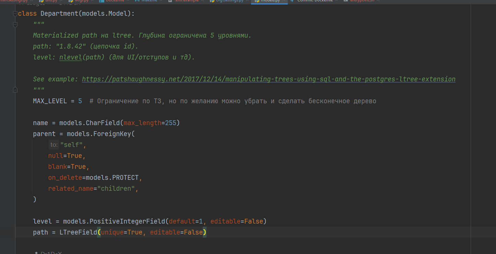
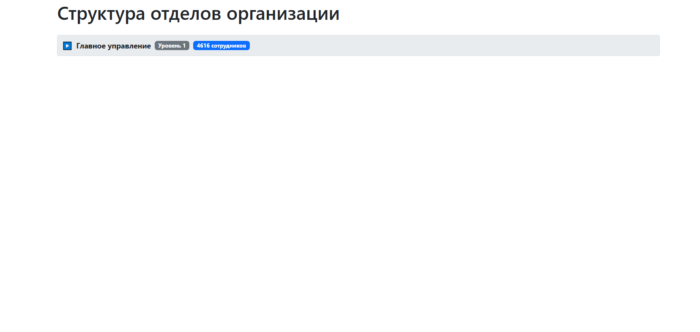
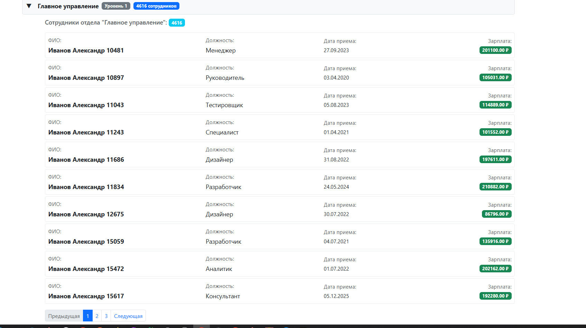

# 💜💜

# traffick-light-test
Тестовое задание Traffick Light
___

## Цель задания
Создайте веб-страницу, которая будет выводить древовидную отделов со списком сотрудников

___

## Ожидаемый результат:
1) Структура иерархии подразделения - до 5 уровней
2) На странице должны быть данные: ФИО, Должность, Дата приема на работу, Размер ЗП, Подразделения
3) БД Должна содержать не менее 50к сотрудников и 25 подразделений в 5 уровней иерархий
4) Управление записями через админку Django
___

## Стек:
1) Django 4+
2) ASGI сервер Daphne
3) Nginx
4) Redis/Channels Redis
5) PostgreSQL + LTree
6) structlog
7) Docker
8) WSGI + gunicorn(прод версия)

___

## Принцип работы:
### Для эффективной работы с древовидной структурой используется LTree + GIST + денормализация для эффективного выполнения запросов, что позволяет оч быстро проходиться по дереву(тестил на 100к юзеров)

___

## Локальный запуск приложения(только инфраструктура)
Я использую пакетный менеждер uv для управления зависимостями, однако можно и через pip

1) Поднять инфру через docker-compose(PostgreSQL, Redis) - `make run-local`
2) Перейти в папку - `backend`
3) Установка зависимостей - `pip install -r requirements.txt` или через uv `uv sync --no-cache`
4) Запуск приложения - `python manage.py runserver`
5) Применить миграции - `python manage.py migrate`
6) Запустить команду генерации тестовых юзеров(100к) - `python manage.py generate_test_data`

Приложение будет доступно по адресу - localhost:8000

___

## Локальный запуск приложения(через докер)
1) Запустить команду сборки проекта - `make run-staging`

Приложение будет доступно по адресу - localhost

___

## Управление данными осуществляется через админку, если вы запустили приложение через Docker то в нем создается тестовый админ, тестовые креды для доступа:
### login - `admin`
### password - `admin`
